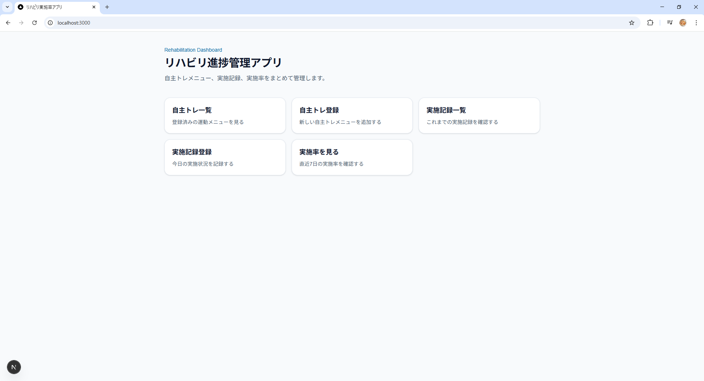
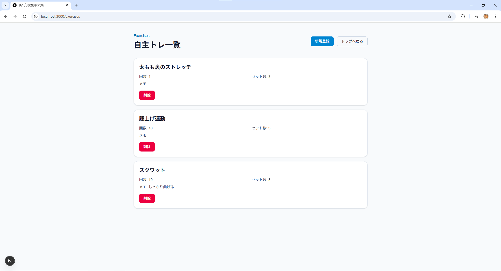
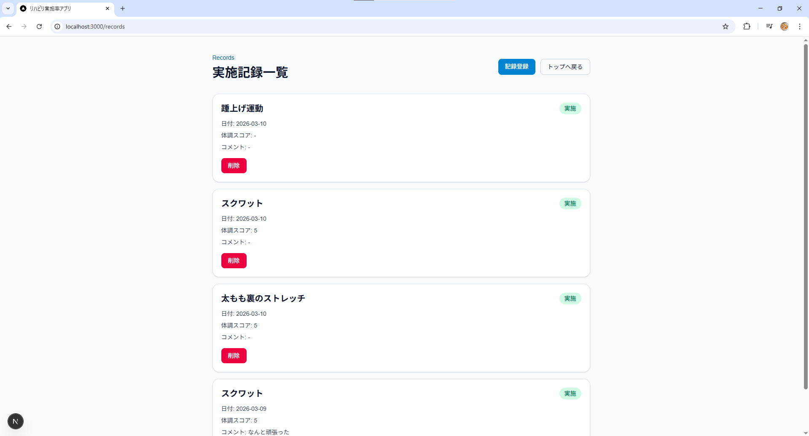
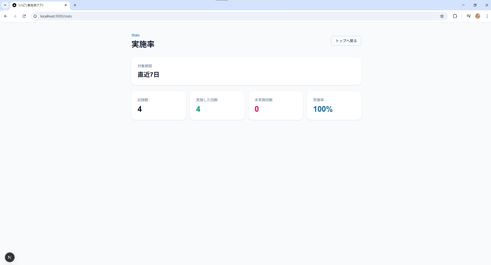

# rehab-log
# リハビリ実施率管理アプリ

自主トレーニングの実施状況を記録し、実施率を可視化するWebアプリです。  
理学療法の現場では「自主トレをどれくらい実施しているか」を把握することが難しいため、  
実施記録を簡単に残し、実施率として可視化できる仕組みを作りました。

---

# アプリ概要

このアプリでは以下のことができます。

- 自主トレーニングメニューの登録
- 自主トレーニングメニューの一覧表示
- 日々の自主トレ実施記録の登録
- 実施記録の一覧表示
- 実施記録の削除
- 自主トレメニューの削除
- 直近7日間の実施率の表示

---

# 背景（なぜ作ったか）

理学療法の臨床では、患者に自主トレーニングを指導することが多いですが、

- 実際にどれくらい実施しているか
- どの日に実施できなかったのか
- 実施率はどれくらいなのか

といった情報は、口頭確認に頼ることが多く、定量的に把握することが難しいです。

そこで

- 自主トレメニュー
- 日々の実施記録
- 実施率の可視化

を簡単に管理できるアプリを作成しました。

---

# 主な機能

## 自主トレ管理

- 自主トレメニューの登録
- 回数・セット数の設定
- メモの追加
- メニュー一覧表示
- メニュー削除

---

## 実施記録管理

- 実施した運動の記録
- 日付の記録
- 実施 / 未実施のチェック
- 体調スコア（1〜10）
- コメント入力
- 記録の削除

---

## 実施率表示

直近7日間の実施率を自動計算して表示します。

例
実施した回数 ÷ 記録回数 × 100

---

# 技術スタック

## フロントエンド

- Next.js (App Router)
- React
- TypeScript
- Tailwind CSS

---

## バックエンド

- Next.js API Routes

---

## データベース

- Prisma ORM
- SQLite

---

# データ構造

## Exercise（自主トレメニュー）

|項目|説明|
|---|---|
|id|ID|
|name|運動名|
|reps|回数|
|sets|セット数|
|memo|メモ|

---

## Record（実施記録）

|項目|説明|
|---|---|
|id|ID|
|exerciseId|対象の運動|
|date|実施日|
|completed|実施したか|
|conditionScore|体調スコア|
|comment|コメント|

---

# 工夫した点

## データ構造の設計

自主トレメニュー（Exercise）と実施記録（Record）を分離し、
Exercise
↓
Record（複数）

という構造にすることで、

- メニュー管理
- 実施履歴管理
- 実施率計算

をシンプルに実装しました。

---

## フォームバリデーション

フロント側で以下の入力チェックを行っています。

- 必須項目チェック
- 数値チェック
- 体調スコアの範囲チェック（1〜10）

不正なデータがDBに保存されないようにしています。

---

## 削除処理の整合性

Exercise削除時に、紐づくRecordを先に削除することで  
データの整合性が崩れないようにしています。

---

# 今後の改善

今後は以下の機能を追加予定です。

- 実施率グラフの表示
- カレンダー形式での実施履歴表示
- 自主トレ実施リマインド
- 患者ごとの記録管理

---

# 画面イメージ

## トップ画面

## 自主トレ一覧

## 実施記録一覧

## 実施率

# 作者

理学療法士としての経験を活かし、
医療とITを組み合わせたアプリ開発を目指しています。
